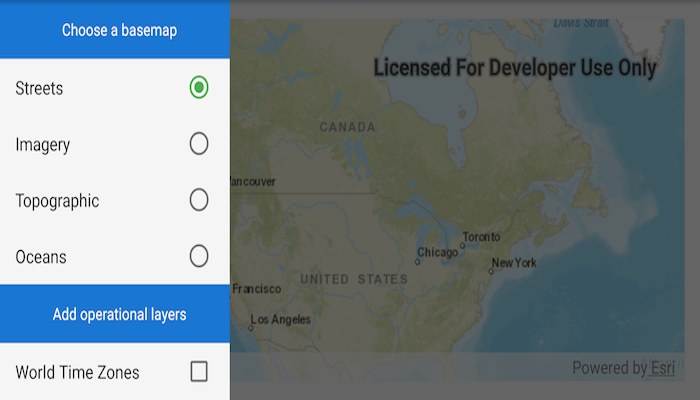

# Create and save map

Create and save a map as an ArcGIS `PortalItem` (i.e. web map).

## Use case

Maps can be created programmatically in code and then serialized and saved as an ArcGIS web map. A web map can be shared with others and opened in various applications and APIs throughout the platform, such as ArcGIS Pro, ArcGIS Online, the JavaScript API, Collector, and Explorer.

## How to use the sample

Use the navigation drawer to select the basemap and layers you'd like to add to your map. Tap the save button and enter a title, tags, and description for your map and then hit 'Save Map'. Sign into an ArcGIS Online account when prompted and save the map.

## How it works

1. An `ArcGISMap` is created with a `Basemap` and a few operational layers.
2. A `Portal` object is created and loaded. This will issue an authentication challenge, prompting the user to provide credentials.
3. Use `ArcGISMap.saveAsAsync(...)` passing in the `Portal`, and information about the map, to save the map to the portal.

## Relevant API

* ArcGISMap
* Portal

## Additional information

In this sample, API keys are set directly on the `Basemap` rather than on the `ArcGISRuntimeEnvironment`. This is done to allow the developer to provide the app with access to a range of `BasemapStyle`s, but also allow the user to save the final map to their own ArcGISOnline account.

## Tags

ArcGIS Online, ArcGIS Pro, portal, publish, share, web map
